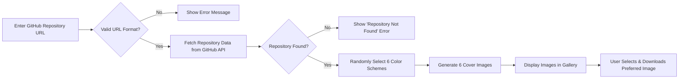

```mermaid
flowchart LR
    A[Enter GitHub Repository URL] --> B{Valid URL Format?}
    B -->|No| C[Show Error Message]
    B -->|Yes| D[Fetch Repository Data from GitHub API]
    D --> E{Repository Found?}
    E -->|No| F[Show 'Repository Not Found' Error]
    E -->|Yes| G[Randomly Select 6 Color Schemes]
    G --> H[Generate 6 Cover Images]
    H --> I[Display Images in Gallery]
    I --> J[User Selects & Downloads Preferred Image]
```